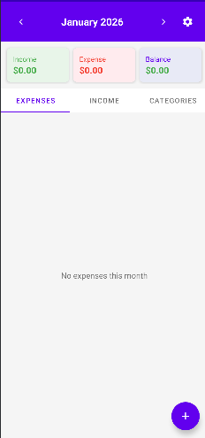
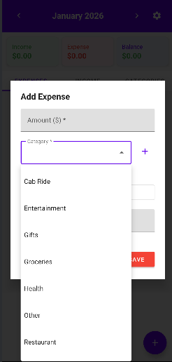
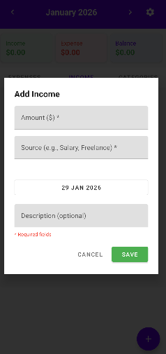
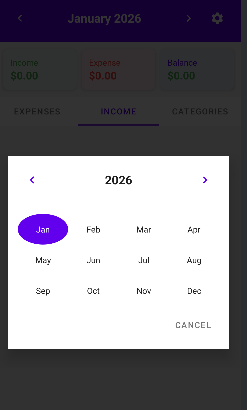

# Expense Tracker

A simple and intuitive Android app to track your daily expenses and income. Built with Kotlin and Jetpack components.

## Features

- **Track Expenses & Income**: Easily add, edit, and delete your financial transactions
- **Category Management**: Organize expenses by categories (Groceries, Entertainment, Travel, etc.)
- **Custom Categories**: Add your own categories beyond the defaults
- **Monthly Overview**: View expenses and income by month with easy navigation
- **Category Drill-Down**: Tap on any category to see all expenses under it
- **Balance Summary**: See your income, expenses, and balance at a glance
- **Data Backup**: Export and import your data as JSON files

## Screenshots

| Home Screen | Categories | Add Expense |
|:-----------:|:----------:|:-----------:|
|  |  |  |

| Add Income | Month Picker |
|:----------:|:------------:|
|  |  |

## Tech Stack

- **Language**: Kotlin
- **Architecture**: MVVM (Model-View-ViewModel)
- **Database**: Room Persistence Library
- **UI Components**:
  - Material Design Components
  - ViewPager2 with TabLayout
  - RecyclerView with ListAdapter
  - CardView
- **Async Operations**: Kotlin Coroutines
- **Lifecycle**: LiveData, ViewModel

## Project Structure

```
app/src/main/java/com/expensetracker/
├── data/
│   ├── AppDatabase.kt          # Room database setup
│   ├── Expense.kt              # Expense entity
│   ├── ExpenseDao.kt           # Expense data access object
│   ├── Income.kt               # Income entity
│   ├── IncomeDao.kt            # Income data access object
│   ├── Category.kt             # Category entity
│   ├── CategoryDao.kt          # Category data access object
│   ├── Repository.kt           # Data repository
│   └── BackupManager.kt        # Import/Export functionality
└── ui/
    ├── MainActivity.kt         # Main activity with tabs
    ├── MainViewModel.kt        # Shared ViewModel
    ├── ExpenseListFragment.kt  # Expenses list tab
    ├── IncomeListFragment.kt   # Income list tab
    ├── CategoryListFragment.kt # Categories tab
    ├── CategoryExpensesActivity.kt # Category drill-down
    ├── ExpenseAdapter.kt       # Expense list adapter
    ├── IncomeAdapter.kt        # Income list adapter
    ├── CategoryAdapter.kt      # Category list adapter
    └── ViewPagerAdapter.kt     # Tab adapter
```

## Default Categories

- Groceries
- Entertainment
- Cab/Ride
- Restaurant
- Travel
- Gifts
- Utilities
- Shopping
- Health
- Other

## Getting Started

### Prerequisites

- Android Studio Arctic Fox or later
- Android SDK 21 or higher
- Kotlin 1.5+

### Installation

1. Clone the repository:
   ```bash
   git clone https://github.com/yourusername/ExpenseTracker.git
   ```

2. Open the project in Android Studio

3. Sync Gradle and build the project

4. Run on an emulator or physical device

## Usage

### Adding an Expense
1. Tap the floating action button (+)
2. Enter the amount
3. Select a category from the dropdown
4. Add an optional description
5. Select the date
6. Tap "Save"

### Viewing Category Breakdown
1. Navigate to the "Categories" tab
2. Tap on any category to see all expenses under it
3. Tap on an expense to edit it

### Changing Month
- Use the left/right arrows in the header to navigate months
- Tap on the month name to open the month picker

### Backup & Restore
1. Tap the settings icon (gear)
2. Choose "Export Data" to save to Downloads folder
3. Choose "Import Data" to restore from a JSON file

## License

This project is licensed under the MIT License - see the [LICENSE](LICENSE) file for details.

## Contributing

1. Fork the repository
2. Create your feature branch (`git checkout -b feature/AmazingFeature`)
3. Commit your changes (`git commit -m 'Add some AmazingFeature'`)
4. Push to the branch (`git push origin feature/AmazingFeature`)
5. Open a Pull Request
